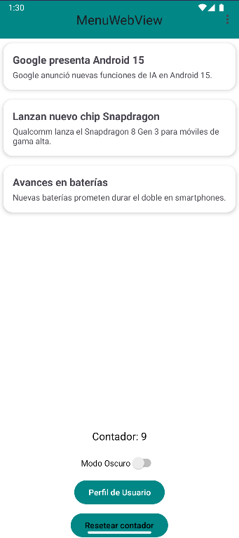
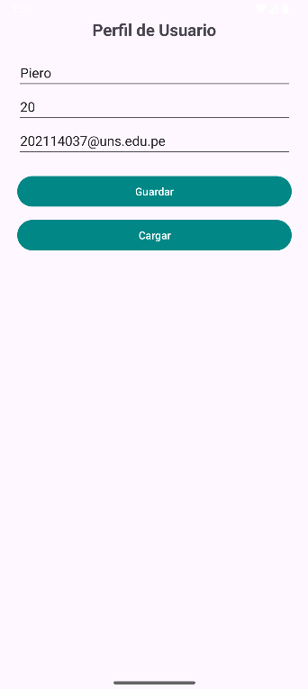
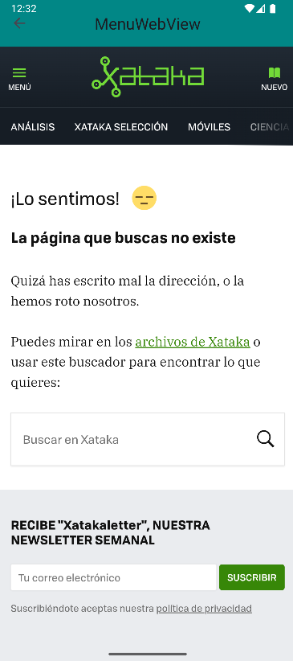
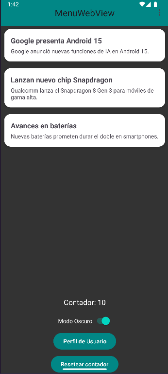

# SEMANA 9  
# ALUMNO: LIZA GUERRERO PIERO ALEXANDRO  
# CÓDIGO: 0202114037  

# SharedPreferencesApp

**SharedPreferencesApp** es una aplicación Android desarrollada para el curso **Aplicaciones Móviles** (Ingeniería de Sistemas, Semana 9). El objetivo es demostrar el uso de **SharedPreferences** en una app moderna bajo Material Design 3, e integrar menús, WebView, perfil de usuario y un contador persistente de visitas.

---

## 🚩 ¿QUÉ HACE LA APLICACIÓN?

La app implementa:
- **Contador de visitas:** Cuenta cuántas veces se ha abierto la app y permite resetear el contador.
- **Modo Oscuro/Claro:** Switch para cambiar el modo visual en tiempo real y guardar la preferencia del usuario.
- **Perfil de Usuario:** Pantalla para ingresar, guardar y cargar datos personales (nombre, edad, email) usando SharedPreferences.
- **Noticias de tecnología:** Lista de noticias con menús contextuales y de opciones, posibilidad de abrir la noticia en un WebView.

---

## 🎨 FUNCIONALIDADES Y COMPONENTES IMPLEMENTADOS

- **Material Design 3:**  
  Toda la app usa estilos modernos, colores y tipografía Material 3.
- **Contador persistente:**  
  Se incrementa cada vez que el usuario abre la app y se guarda con SharedPreferences.
- **Modo Oscuro/Claro:**  
  Cambia colores de fondo y texto al instante, preferencia guardada y persistente.
- **Pantalla de Perfil de Usuario:**  
  Ingreso, guardado y carga de nombre, edad y email. Datos persistentes aun cerrando la app.
- **Menus (Options & Context):**  
  Menú de tres puntos (Options) y menú contextual (pulsación larga).
- **WebView integrado:**  
  Visualización embebida de noticias desde la app.
- **Compatibilidad:**  
  Funciona desde Android 7.1 (API 25) hasta las versiones más recientes.

---

## 🗂️ SECCIONES PRINCIPALES

- **Inicio:**  
  Contador de visitas, Switch de modo oscuro, acceso al perfil y lista de noticias.
- **Perfil de Usuario:**  
  Ingreso, guardado y carga de información personal.
- **Noticias:**  
  Lista con menú contextual y acceso a WebView.
- **WebView:**  
  Navegación de la noticia elegida dentro de la app.

---

## 🖼️ CAPTURAS DE PANTALLA

<!-- Sube tus imágenes a la carpeta /images del repo y enlaza así: -->

<p align="center">
  
  
  
  
  
</p>

---

## 🔨 CÓMO SE HIZO

1. **Proyecto creado en Android Studio con Kotlin y Material 3.**
2. **Se configuró el tema personalizado** para colores claros y oscuros desde código.
3. **Contador de visitas:** Implementado y persistido con SharedPreferences.
4. **Switch de modo oscuro:** Cambia fondo/texto y guarda la preferencia.
5. **Pantalla de perfil:** Nueva Activity con formulario y guardado/carga usando SharedPreferences.
6. **RecyclerView y menús:** Noticias en tarjetas con menú contextual y de opciones.
7. **WebView:** Noticias abiertas en una pantalla interna.
8. **Códigos limpios, comentados y orientados a buenas prácticas.**

---

## 💻 INSTALACIÓN Y USO

1. Clona el repositorio:
```bash
git clone https://github.com/tuusuario/SharedPreferencesApp.git
```
1. **Abre el proyecto en Android Studio.**
2. **Sincroniza dependencias si lo pide.**
3. **Ejecuta en un emulador o dispositivo físico (Android 7.1/API 25+).**

## ⚡ NOTAS FINALES
**App desarrollada solo para fines académicos.**

**Puedes cambiar las URLs de noticias, colores o textos a gusto.**

**Cumple todos los puntos requeridos de la Semana 9: contador, perfil y modo oscuro/ claro con persistencia.**

